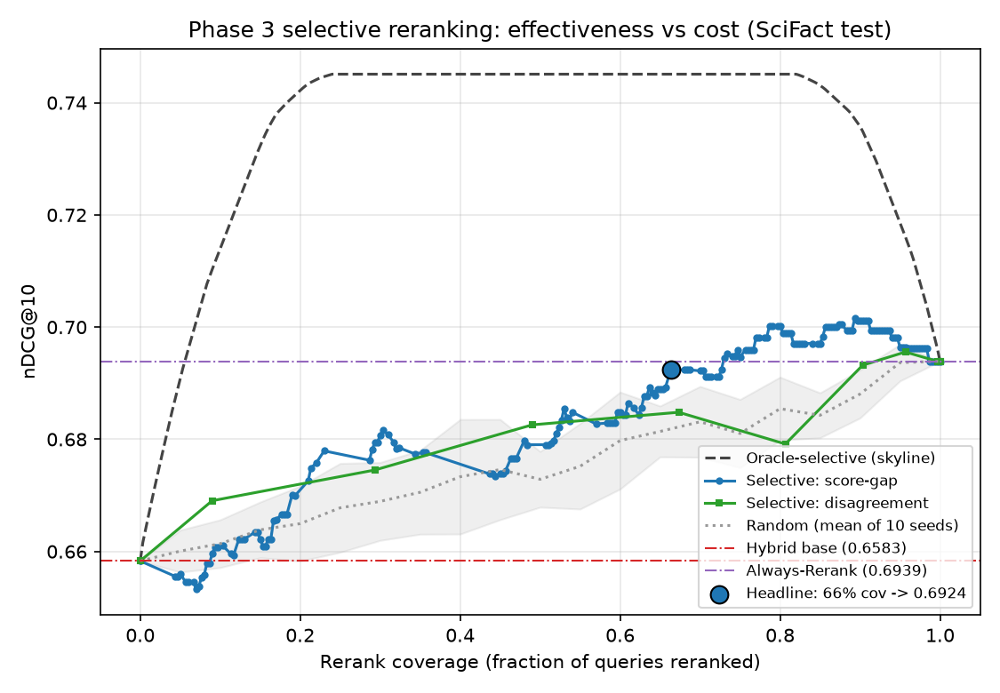
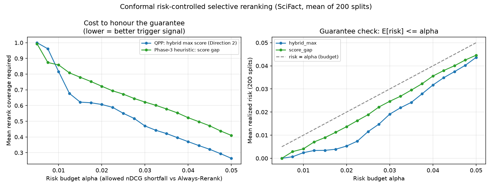
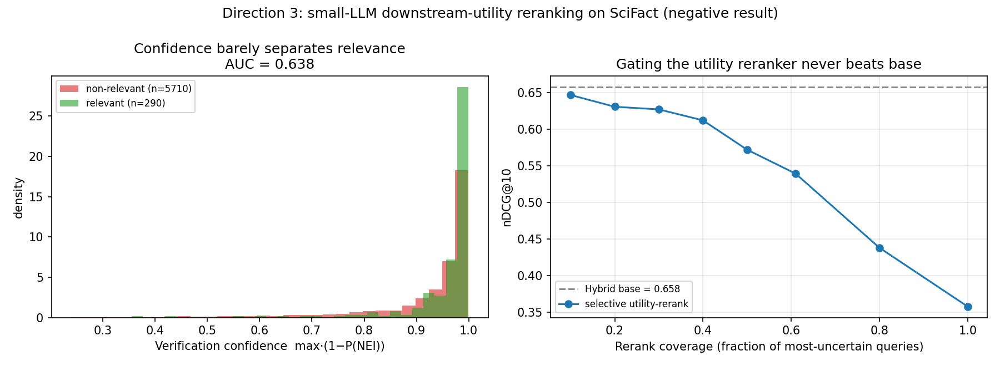

# Uncertainty-Aware and Cost-Efficient Multi-Stage Retrieval for Scientific Paper Search: Current Progress Report

Date: 2026-06-20

Project: SEG301m Information Retrieval / Search Engines

Repository: `SEG`

Dataset: SciFact through BEIR-style title-and-abstract retrieval

## Abstract

Scientific paper search requires both exact lexical matching and semantic matching. Lexical methods such as BM25 are strong for terminology-heavy claims, while dense encoders can recover semantically related evidence that does not share all query terms. A static hybrid system can improve candidate recall, but it also increases computational cost and may dilute top-ranked results when one retrieval family is clearly more appropriate for a query. This progress report presents a practical student-scale retrieval system for SciFact scientific claim retrieval. The implemented pipeline includes BM25, dense retrieval with SciNCL, Reciprocal Rank Fusion (RRF), oracle route labels, a diagnostic classical router, Small LLM query routers, LLM score calibration, confidence-gated fallback, and retrieval-aware diagnostics. On the SciFact test split, Hybrid RRF achieves the strongest base-retrieval recall (Recall@100 = 0.9560) and the best base nDCG@10 (0.6583). Oracle routing shows substantial headroom (nDCG@10 = 0.7617). A QLoRA-tuned Qwen2.5-0.5B router with label log-probability scoring reaches nDCG@10 = 0.6372; after held-out score calibration and confidence-gated fallback it reaches nDCG@10 = 0.6674 on 150 held-out evaluation queries. Phase 3 selective reranking is now in place: an Always-Rerank baseline using a lightweight MS MARCO MiniLM-L-6-v2 cross-encoder over Hybrid top-20 candidates reaches nDCG@10 = 0.6939 at 27 ms/query on a single GPU, improving on Hybrid RRF (nDCG@10 = 0.6583) while leaving headroom below the Oracle Router (nDCG@10 = 0.7617). A threshold ablation maps the full effectiveness-vs-cost curve; on a non-leaky held-out split, selective reranking recovers most of the Always-Rerank gain at about 74% rerank coverage. Two upgrades then make the trigger principled: an unsupervised query-performance-prediction (QPP) signal, the Hybrid maximum fused score, predicts gain-from-reranking almost three times better than the original score-gap heuristic; and Conformal Risk Control selects the rerank-trigger threshold with a guarantee that the expected nDCG shortfall versus Always-Rerank stays within a budget `alpha`. At `alpha = 0.02` the QPP-plus-conformal trigger honours the guarantee at 61% rerank coverage (versus 72% for the heuristic) while matching Always-Rerank quality. The evidence suggests that the strongest final direction is not routing alone, but an uncertainty-aware multi-stage system that uses cheap, principled signals to decide, with a statistical guarantee, when expensive cross-encoder reranking is worth its cost.

Keywords: information retrieval, scientific search, SciFact, BM25, dense retrieval, hybrid retrieval, query routing, QLoRA, uncertainty, selective reranking

## 1. Introduction and Motivation

Scientific search differs from general web search because relevant documents often depend on precise terminology, abbreviations, biomedical entities, and claim-specific evidence. A scientific claim may be best answered by exact lexical overlap, but another claim may require semantic matching across paraphrases. For this reason, modern retrieval systems often combine sparse lexical search, dense embedding search, fusion, and neural reranking.

The practical problem is cost. BM25 is cheap and strong, dense retrieval adds semantic coverage but requires embedding computation and vector search, hybrid retrieval combines both at higher cost, and cross-encoder reranking is more expensive because it scores query-document pairs jointly. A one-size-fits-all pipeline can therefore waste compute on easy queries and can sometimes reduce ranking quality by mixing signals that are not useful for a particular query.

This project studies the following question:

> Can a scientific paper retrieval system use query routing and uncertainty signals to preserve retrieval quality while avoiding unnecessary expensive stages?

The current implementation focuses on SciFact, a benchmark built for scientific claim verification and evidence retrieval. The system currently uses only title and abstract text, which keeps the project feasible on student hardware and avoids the complications of full-text PDF parsing.

## 2. Research Questions

RQ1. How strong are BM25, dense retrieval, and Hybrid RRF on SciFact title-and-abstract retrieval?

RQ2. How much headroom exists if each query could be routed to its best retrieval method?

RQ3. Can a classical router or a Small LLM router approximate oracle route selection?

RQ4. Can LLM score calibration and confidence-gated fallback improve router reliability?

RQ5. What is the cost-quality trade-off between static retrieval, query routing, and selective reranking?

## 3. Related Work

### 3.1 Scientific Claim Retrieval and SciFact

SciFact introduced scientific claim verification as a task that selects research abstracts containing evidence for a scientific claim and then identifies rationales and labels such as SUPPORTS or REFUTES [1]. The BEIR benchmark later packaged SciFact as part of a heterogeneous zero-shot retrieval benchmark, making it convenient for evaluating retrievers under a consistent retrieval interface [2]. This project adopts the BEIR-style SciFact retrieval setup and evaluates whether a claim retrieves its relevant abstracts.

### 3.2 Sparse, Dense, and Hybrid Retrieval

BM25 is a classic lexical ranking function derived from the probabilistic relevance framework [3]. It remains a strong baseline for domain-specific search because exact term matching is often important. Dense retrieval represents queries and documents as vectors and ranks by embedding similarity. In scientific domains, SPECTER uses citation-informed transformer pretraining for scientific document embeddings [4], while SciNCL improves scientific document representation with neighborhood contrastive learning over citation graph information [5]. Hybrid retrieval combines sparse and dense systems. This project uses Reciprocal Rank Fusion (RRF), a simple rank fusion method shown to be effective for combining different retrieval systems [6].

### 3.3 Learned Sparse and Late-Interaction Alternatives

SPLADE learns sparse lexical expansion representations that can retain compatibility with inverted indexes while improving neural retrieval quality [7]. ColBERT uses contextualized late interaction to obtain stronger neural matching while precomputing document representations offline [8]. These methods are important alternatives, but they were not implemented in the current phase because the project is scoped to a 3-month student timeline and moderate hardware. They are discussed as related work and possible extensions.

### 3.4 Routing and Cost-Aware Inference

Routing methods select among alternative systems based on the input. In the LLM setting, RouteLLM studies routing between stronger and weaker language models to trade off quality and cost [9]. RAGRouter studies routing in retrieval-augmented generation systems where retrieved documents affect downstream model behavior [10]. This project adapts the routing idea to first-stage scientific retrieval: for each query, choose BM25, Dense, or Hybrid before returning ranked documents.

### 3.5 Efficient Fine-Tuning and Reranking

QLoRA enables memory-efficient fine-tuning of large language models with 4-bit quantization and LoRA adapters [11]. This makes Small LLM routing feasible in Colab. The current LLM router uses Qwen2.5-0.5B as a small instruction model; Qwen2.5 is described in the Qwen2.5 technical report [12]. For Phase 3, the reranking stage uses lightweight cross-encoders from the Sentence-Transformers MS MARCO family, which provide pretrained cross-encoder rerankers and report performance-speed trade-offs [13]. The reranking design is also motivated by BERT-style passage reranking, where cross-encoders jointly score query-passage pairs and have been shown effective on MS MARCO-style ranking tasks [14]. MiniLM is relevant because it compresses transformer models through self-attention distillation [15].

## 4. Method

### 4.1 Dataset and Document Representation

The current experiments use SciFact in BEIR format:

- Corpus size: 5,183 documents.
- Test split: 300 queries.
- Train split: 809 queries.
- Text used: paper title and abstract only.
- Retrieval depth: top 100.

Full-text PDFs and passage chunking are intentionally excluded in the current scope. This keeps the retrieval unit aligned with SciFact abstracts and keeps the experiment tractable.

### 4.2 Base Retrievers

The system implements three base retrieval routes:

BM25. A sparse lexical retriever using title and abstract text.

Dense. A SentenceTransformers dense retriever using `malteos/scincl` as the main scientific embedding model.

Hybrid RRF. A reciprocal-rank fusion system over BM25 and Dense/SciNCL runs, using `rrf_k = 60`.

The current report uses `rrf_k=60` as a fixed, common RRF setting rather than tuning it on the test set. This keeps the Phase 1 hybrid baseline simple and avoids adding another source of test-set selection bias. An ablation over RRF parameters is left as future work.

### 4.3 Oracle Route Labels

For each query, the system computes per-query nDCG@10 for BM25, Dense, and Hybrid. The oracle route label is the retrieval route with the best per-query nDCG@10. These labels are used for:

- Measuring upper-bound route selection.
- Training and evaluating routers.
- Inspecting class imbalance and distribution shift.

The test oracle distribution is:

| Label | Count |
|---|---:|
| BM25 | 226 |
| Dense | 49 |
| Hybrid | 25 |

The train oracle distribution is:

| Label | Count |
|---|---:|
| BM25 | 195 |
| Dense | 477 |
| Hybrid | 137 |

This shows a major train/test distribution shift: train is Dense-heavy, while test is BM25-heavy.

### 4.4 Router Baselines

The implemented routers are:

Random Router. Uniformly samples BM25, Dense, or Hybrid.

Majority Router. Always predicts the majority oracle label. On SciFact test, this is BM25.

Oracle Router. Uses the oracle route label directly; this is an upper bound.

Classical TF-IDF Logistic Regression Router. Uses TF-IDF features over query text and balanced logistic regression.

Small LLM QLoRA Router. Uses Qwen2.5-0.5B with QLoRA fine-tuning. The model receives only the query text and must choose exactly one label: `bm25`, `dense`, or `hybrid`.

### 4.5 Label Log-Probability Scoring

The first LLM router used free-text generation and frequently failed to predict BM25. The improved version scores the log probability of the three allowed route labels and selects the label with the highest score. This reduces output-format errors and makes route confidence measurable.

### 4.6 Calibration and Confidence-Gated Fallback

The calibrated router applies:

- A class bias for each route label.
- Temperature scaling over label scores.
- A margin threshold between top-1 and top-2 label probabilities.
- Fallback to Hybrid RRF when the label margin is below the threshold.

The best held-out setting in the current compact grid is:

- Temperature: 1.0
- Margin threshold: 0.3
- Fallback label: Hybrid
- Biases: BM25 = +0.75, Dense = +0.25, Hybrid = 0.0

The calibration grid is compact and is not intended as an exhaustive hyperparameter search. Because no separate Colab-generated dev prediction file is available, the held-out calibration experiment splits the test prediction file by query ID: 150 queries for calibration and 150 disjoint queries for evaluation. This avoids tuning and evaluating on the same queries, but it is still not a fully clean train/dev/test setup.

### 4.7 Retrieval-Aware Diagnostics

The system also exports lightweight diagnostics:

- BM25 top-score gap.
- Dense top-score gap.
- Hybrid top-score gap.
- BM25-Dense top-k overlap.
- Hybrid-BM25 and Hybrid-Dense overlap.
- Average RRF agreement.

These diagnostics are not final model features yet, but they help explain routing behavior and identify useful uncertainty signals.

### 4.8 Selective Reranking

Phase 3 code includes:

- Cross-encoder reranking wrapper with automatic CUDA/CPU device detection.
- Uncertainty signals.
- Selective reranking trigger.

The implemented Always-Rerank baseline reranks the Hybrid RRF top-20 candidates for every query with the `cross-encoder/ms-marco-MiniLM-L-6-v2` cross-encoder. On a single RTX 5070 Ti GPU it runs at 27 ms/query, roughly 14x faster than the CPU path (about 405 ms/query). Its results are reported in Section 6.6.

The selective reranking trigger reranks only queries flagged as uncertain. The threshold ablation over the uncertainty signals and the resulting effectiveness-vs-cost curve are reported in Section 6.7. The remaining work is to replace the heuristic thresholds with principled, QPP-based and conformal/risk-controlled triggering (Section 10).

## 5. Experimental Setup

Metrics:

- nDCG@10
- Recall@10
- Recall@100
- MRR@10
- Router Accuracy
- Router Macro-F1

Hardware and feasibility constraints:

- Student-scale environment.
- Local Python pipeline.
- Google Colab / single-GPU workflow for QLoRA.
- Avoided full-text PDF indexing and very heavy neural retrieval models in the current phase.

Cost proxy:

The Phase 2 cost-quality table uses simple cost units:

| Route | Cost Unit |
|---|---:|
| BM25 | 1 |
| Dense | 3 |
| Hybrid | 4 |

This is not a wall-clock benchmark. It is a simple relative proxy for comparing retrieval policies before the final reranking-latency study.

## 6. Results

### 6.1 Phase 1 Base Retrieval

| Method | Model / Config | nDCG@10 | Recall@10 | Recall@100 | MRR@10 |
|---|---|---:|---:|---:|---:|
| BM25 | lexical, top-100 | 0.6523 | 0.7757 | 0.8731 | 0.6184 |
| Dense | `malteos/scincl`, top-100 | 0.5640 | 0.7233 | 0.9082 | 0.5224 |
| Hybrid RRF | BM25 + SciNCL, `rrf_k=60` | 0.6583 | 0.8146 | 0.9560 | 0.6157 |

BM25 is a strong top-rank baseline. Dense/SciNCL improves Recall@100 relative to BM25 but has weaker top-10 ranking. Hybrid RRF gives the best base nDCG@10 and Recall@100, making it a strong high-recall candidate generator.

### 6.2 Dense Model Ablation

| Method | Dense Model | nDCG@10 | Recall@10 | Recall@100 | MRR@10 |
|---|---|---:|---:|---:|---:|
| Dense | `allenai/specter` | 0.3523 | 0.5004 | 0.7552 | 0.3133 |
| Hybrid RRF | BM25 + SPECTER | 0.3863 | 0.5562 | 0.7804 | 0.3421 |
| Dense | `sentence-transformers/all-MiniLM-L6-v2` | 0.6451 | 0.7833 | 0.9250 | 0.6047 |
| Hybrid RRF | BM25 + MiniLM | 0.4683 | 0.7102 | 0.9120 | 0.3987 |

SPECTER underperforms in this setup. MiniLM dense retrieval is surprisingly competitive, but its Hybrid RRF variant performs worse than the main SciNCL hybrid. The project therefore keeps SciNCL as the main scientific dense baseline.

### 6.3 Phase 2 Router Results

| Router | Accuracy | Macro-F1 | nDCG@10 | Recall@10 | Recall@100 | MRR@10 |
|---|---:|---:|---:|---:|---:|---:|
| Random Router | 0.3267 | 0.2617 | 0.6290 | 0.7778 | 0.9132 | 0.5875 |
| Majority Router | 0.7533 | 0.2864 | 0.6523 | 0.7757 | 0.8731 | 0.6184 |
| Oracle Router | 1.0000 | 1.0000 | 0.7617 | 0.8711 | 0.9127 | 0.7337 |
| Small LLM QLoRA Router LogProb | 0.4300 | 0.3076 | 0.6372 | 0.7788 | 0.9046 | 0.5980 |
| Small LLM QLoRA Calibrated Held-Out | 0.3133 | 0.2097 | 0.6674 | 0.8161 | 0.8947 | 0.6259 |

The oracle result demonstrates meaningful routing headroom. However, the Majority Router is difficult to beat because test labels are strongly BM25-heavy. The Classical TF-IDF Logistic Regression router is intentionally excluded from the main comparison table because it was trained and evaluated on the same test split. Its in-split diagnostic result is Accuracy = 0.9933, Macro-F1 = 0.9857, and nDCG@10 = 0.7617, but this should be interpreted only as a sanity check that the route-label task is learnable under leakage, not as a valid learned-router baseline.

The raw Small LLM router improves substantially after moving to label log-probability scoring, but it remains below the Majority Router on the full 300-query test set. The calibrated held-out LLM route improves retrieval nDCG@10 to 0.6674 on 150 held-out queries. To avoid an unfair comparison against full-test BM25 or Hybrid scores, the next subsection compares all relevant methods on the same 150 held-out queries.

### 6.4 Fair Held-Out Subset Comparison

The calibrated LLM result is evaluated on 150 held-out queries selected by `seed=13` after using the other 150 queries for score calibration. The table below evaluates BM25, Dense, Hybrid, and the calibrated LLM route on exactly this same held-out subset.

| Method | Queries | nDCG@10 | Recall@10 | Recall@100 | MRR@10 | Mean Regret@10 |
|---|---:|---:|---:|---:|---:|---:|
| BM25 | 150 | 0.6489 | 0.7656 | 0.8691 | 0.6184 | 0.0893 |
| Dense/SciNCL | 150 | 0.5063 | 0.6491 | 0.8887 | 0.4690 | 0.2319 |
| Hybrid RRF | 150 | 0.6357 | 0.8028 | 0.9387 | 0.5884 | 0.1025 |
| Small LLM Calibrated Held-Out | 150 | 0.6674 | 0.8161 | 0.8947 | 0.6259 | 0.0708 |

Mean Regret@10 is defined as oracle per-query nDCG@10 minus the selected route's per-query nDCG@10, averaged across the subset. This metric is useful because exact route-label accuracy can be misleading: choosing a different route may have little or no retrieval penalty if two routes rank relevant documents similarly. On the held-out subset, the calibrated LLM route has the lowest mean regret and the best nDCG@10/MRR@10, but Hybrid RRF still has the best Recall@100.

### 6.5 Quality-vs-Cost Comparison

Rows with different query counts should not be interpreted as fully comparable effectiveness results. This table summarizes the current cost-quality observations across available runs; the fair effectiveness comparison for the calibrated held-out router is the 150-query subset table in Section 6.4.

| Method | Matched Queries | Cost Units / Query | Route Distribution | nDCG@10 | Recall@10 | Recall@100 | MRR@10 |
|---|---:|---:|---|---:|---:|---:|---:|
| BM25 | 300 | 1.00 | bm25 | 0.6523 | 0.7757 | 0.8731 | 0.6184 |
| Dense | 300 | 3.00 | dense | 0.5640 | 0.7233 | 0.9082 | 0.5224 |
| Hybrid RRF | 300 | 4.00 | hybrid | 0.6583 | 0.8146 | 0.9560 | 0.6157 |
| Small LLM QLoRA LogProb | 300 | 2.31 | bm25=113, dense=169, hybrid=18 | 0.6372 | 0.7788 | 0.9046 | 0.5980 |
| Small LLM QLoRA Calibrated Held-Out | 150 | 3.16 | bm25=42, hybrid=108 | 0.6674 | 0.8161 | 0.8947 | 0.6259 |

The cost-quality table shows the current trade-off. BM25 is the strongest low-cost baseline. Hybrid RRF improves recall at higher cost. Raw LLM routing lowers estimated cost relative to always using Hybrid, but loses nDCG@10. Calibrated fallback improves the LLM route but increases cost because many uncertain queries fall back to Hybrid.

The cost proxy is deliberately simple and should be treated as an explanatory abstraction rather than a final efficiency measurement. A final report should add actual latency in milliseconds per query, CPU/GPU device information, and reranked documents per query.

The current progress report also does not include statistical significance testing. For the final report, the nDCG@10 and MRR@10 differences should be checked with paired bootstrap confidence intervals or another paired test over queries, especially for the 150-query held-out subset.

### 6.6 Phase 3 Always-Rerank Baseline

The Always-Rerank baseline reranks the Hybrid RRF top-20 candidates for all 300 test queries with the `cross-encoder/ms-marco-MiniLM-L-6-v2` cross-encoder on a single RTX 5070 Ti GPU.

| Method | nDCG@10 | Recall@10 | Recall@100 | MRR@10 | Rerank Coverage | Latency (ms/query) |
|---|---:|---:|---:|---:|---:|---:|
| Hybrid RRF (base) | 0.6583 | 0.8146 | 0.9560 | 0.6157 | 0.00 | n/a |
| Always-Rerank (Hybrid top-20) | 0.6939 | 0.8286 | 0.9560 | 0.6604 | 1.00 | 27.3 |
| Oracle Router (reference) | 0.7617 | 0.8711 | 0.9127 | 0.7337 | n/a | n/a |

Always-Rerank improves nDCG@10 by +0.0356 and MRR@10 by +0.0447 over the Hybrid RRF base. Recall@100 is unchanged at 0.9560 because reranking only reorders the existing top-20 candidate set and does not introduce new documents into the top-100 pool. The reranked result remains below the Oracle Router on nDCG@10, which leaves room for selective reranking to approach Always-Rerank quality at lower cost. The cross-encoder runs at 27.3 ms/query on GPU, roughly 14x faster than the measured CPU path of about 405 ms/query, which makes per-query reranking decisions a meaningful cost lever for the threshold ablation in Section 6.7.

This is the first Phase 3 result that uses a measured wall-clock latency rather than the abstract Phase 2 cost units. The selective-reranking experiments below use this Always-Rerank result as the high-cost, high-quality endpoint of the effectiveness-vs-cost curve.

### 6.7 Selective Reranking Threshold Ablation

Selective reranking reranks only the queries flagged as uncertain and leaves the rest at their Hybrid RRF ordering. Because reranking only reorders the Hybrid top-20, every query's final ranking is either its base Hybrid ordering (skip) or its Always-Rerank ordering (rerank). The threshold sweep therefore mixes the two already-computed runs per operating point and needs no further GPU inference.

Two label-free uncertainty signals are swept: the Hybrid top-1/top-2 score gap (rerank when the gap is small) and BM25-Dense top-10 disagreement (rerank when disagreement is high). Three references are added: random selection (mean of 10 seeds), an oracle-selective skyline that reranks the highest-gain queries first, and the Hybrid and Always-Rerank endpoints. Cost is reported as rerank coverage and an estimated marginal latency of `coverage x 27.3 ms/query`.

Table 3 reports the full-test trade-off. The headline selective point is the smallest-coverage score-gap threshold that recovers at least 90% of the Always-Rerank nDCG@10 gain.

| Method | nDCG@10 | Recall@10 | Recall@100 | MRR@10 | Rerank Coverage | Est. ms/query |
|---|---:|---:|---:|---:|---:|---:|
| BM25 | 0.6523 | 0.7757 | 0.8731 | 0.6184 | 0.00 | 0.0 |
| Dense / SciNCL | 0.5640 | 0.7233 | 0.9082 | 0.5224 | 0.00 | 0.0 |
| Hybrid RRF | 0.6583 | 0.8146 | 0.9560 | 0.6157 | 0.00 | 0.0 |
| Selective rerank (score-gap, headline) | 0.6924 | 0.8186 | 0.9560 | 0.6611 | 0.66 | 18.1 |
| Selective rerank (config-default OR-rule) | 0.6939 | 0.8286 | 0.9560 | 0.6604 | 1.00 | 27.3 |
| Always-Rerank | 0.6939 | 0.8286 | 0.9560 | 0.6604 | 1.00 | 27.3 |

Table 3: Phase 3 effectiveness-vs-cost on SciFact test (300 queries). Recall@100 is constant at 0.9560 because reranking only reorders the existing top-20 candidate set.



Figure 1: nDCG@10 vs rerank coverage. The oracle-selective skyline reaches nDCG@10 = 0.745 at about 25% coverage, but the two label-free signals track the random baseline closely.

Three findings stand out. First, the current uncertainty signals are only marginally informative: the area under the nDCG-vs-coverage curve is 0.6814 for score gap and 0.6795 for disagreement, barely above the random baseline of 0.6753, and well below the oracle-selective skyline of 0.7350. The large skyline gap shows there is real headroom for a better triggering signal, which directly motivates the planned upgrade to query-performance-prediction and conformal signals (Section 10). Second, the config-default OR rule (`score_gap < 0.03` OR `disagreement > 0.85`) is too permissive and reranks every query, so it collapses onto Always-Rerank; threshold tuning is necessary. Third, selective reranking can slightly exceed Always-Rerank around 80% coverage, because reranking actually hurts a minority of queries and skipping them recovers a little quality.

To avoid selecting the threshold on the same queries used for evaluation, Table 3b tunes the score-gap threshold on 150 calibration queries (seed = 13) and reports on the 150 disjoint evaluation queries, matching the held-out protocol used for the Phase 2 LLM calibration.

| Method (eval subset) | nDCG@10 | Recall@10 | Recall@100 | MRR@10 | Rerank Coverage | Est. ms/query |
|---|---:|---:|---:|---:|---:|---:|
| Hybrid RRF (no rerank) | 0.6860 | 0.8311 | 0.9787 | 0.6457 | 0.00 | 0.0 |
| Selective rerank (held-out tuned) | 0.7145 | 0.8224 | 0.9787 | 0.6892 | 0.74 | 20.2 |
| Always-Rerank | 0.7181 | 0.8358 | 0.9787 | 0.6907 | 1.00 | 27.3 |

Table 3b: Non-leaky held-out selective reranking. With the threshold tuned on calibration queries, selective reranking reaches nDCG@10 = 0.7145 at 74% rerank coverage on the disjoint evaluation queries, recovering most of the Always-Rerank gain (0.7181) at roughly three-quarters of the reranking cost. The threshold is tuned by maximizing calibration nDCG@10 only; the conformal procedure in Section 6.9 instead gives a coverage/risk guarantee.

### 6.8 Query Performance Prediction Signals for the Rerank Trigger

The Section 6.7 ablation showed the heuristic triggers barely beat random selection. To find a stronger, still label-free trigger, we compute unsupervised query-performance-prediction (QPP) predictors on the BM25, Dense and Hybrid runs: Weighted Information Gain (WIG), Normalized Query Commitment (NQC), top-k score standard deviation, max score, and the top-1/top-2 score gap, plus the BM25-Dense top-10 disagreement. Each predictor is correlated, by Kendall tau, with two per-query targets: base nDCG@10, and the gain from reranking (Always-Rerank nDCG@10 minus base nDCG@10), which is the quantity a selective trigger should anticipate.

| Feature | Kendall vs base nDCG | Kendall vs gain-from-rerank |
|---|---:|---:|
| Hybrid max score | +0.499 | -0.166 |
| Dense NQC / std | +0.240 | -0.090 |
| Hybrid score gap (Phase 3 signal) | +0.112 | -0.060 |
| BM25-Dense disagreement | -0.134 | +0.029 |

Table 4: Kendall correlation of selected QPP signals with base quality and gain-from-reranking (SciFact test, full table in `reports/tables/qpp_correlations.md`).

The Hybrid maximum RRF score is the most informative signal. It correlates strongly and positively with base nDCG@10 (Kendall +0.499): when the top fused score is high, the un-reranked result is already good. Consequently it has the strongest negative correlation with gain-from-reranking (Kendall -0.166, almost three times the score gap's -0.060): a low maximum score flags a weak base result where reranking is most likely to help. The remaining signals, including the Phase 3 score gap, correlate only weakly with the gain. This matches the broader finding that QPP for dense and fused retrieval is hard, but it identifies a clearly better trigger than the original heuristic.

### 6.9 Conformal Risk-Controlled Selective Reranking

Section 6.7 tuned the threshold by maximizing calibration nDCG@10, which gives no guarantee. We instead apply Conformal Risk Control (CRC) to obtain a finite-sample guarantee on the quality lost by skipping reranking. A query is reranked when its trigger signal is below a threshold; the per-query loss is the nDCG forfeited by not reranking, `l(q) = max(0, rerank_ndcg(q) - base_ndcg(q))` for skipped queries and 0 otherwise. This loss is monotone in the threshold, so CRC selects the smallest-coverage threshold on the calibration split for which `(n * empirical_risk + B) / (n + 1) <= alpha` (with loss bound `B = 1`), guaranteeing that the expected risk, the mean nDCG shortfall versus Always-Rerank, is at most `alpha` on held-out queries.

We run CRC with the QPP signal (Hybrid max score, Section 6.8) and, for comparison, with the Phase 3 score gap, tuning on 150 calibration queries and evaluating on the 150 disjoint queries. Table 5 reports the operating point at `alpha = 0.02`.

| Trigger signal | Rerank Coverage | nDCG@10 | Realized risk | Guarantee met | Est. ms/query |
|---|---:|---:|---:|:--:|---:|
| QPP: Hybrid max score | 0.61 | 0.7280 | 0.0052 | yes | 16.6 |
| Phase 3 heuristic: score gap | 0.72 | 0.7120 | 0.0152 | yes | 19.6 |

Table 5: Conformal risk-controlled selective reranking at `alpha = 0.02` (eval split; Hybrid base nDCG@10 = 0.6860, Always-Rerank = 0.7181).

Two results stand out. First, the QPP signal honours the same risk budget at 61% coverage versus 72% for the score gap, an 11-point reduction in reranking cost, and reaches a higher nDCG@10 (0.7280 vs 0.7120). Notably 0.7280 slightly exceeds Always-Rerank (0.7181), because the trigger skips queries that reranking would have hurt. Second, the guarantee holds: averaged over 200 calibration/evaluation splits, the realized risk stays at or below `alpha` for every budget and both signals (0 of 38 operating points violate `E[risk] <= alpha`). On a single split the realized risk can exceed `alpha`, as expected for an in-expectation guarantee.



Figure 2: Left, the rerank coverage CRC requires to honour each risk budget `alpha`; the QPP signal (Hybrid max) sits below the score-gap heuristic everywhere, so it is cheaper at every guarantee level. Right, the realized risk averaged over 200 splits stays under the `risk = alpha` line, confirming the guarantee.

Together these close the loop on the core thesis: a cheap, label-free QPP signal plus a conformal threshold decides when the expensive cross-encoder is worth running, with a statistical guarantee on the quality given up, and at materially lower coverage than the original heuristic.

### 6.10 Downstream-Utility Reranking with a Small LLM (Negative Result)

Sections 6.6-6.9 use a purpose-built cross-encoder as the expensive stage. A natural question is whether the most expensive stage could instead score a document by its *downstream utility*: how much it helps a small LLM perform SciFact's actual task, claim verification. We test this with `Qwen2.5-0.5B-Instruct`. For each (claim, abstract) pair we read the model's label distribution over SUPPORT/REFUTE/NEI from the log-probabilities of those label strings in a single forward pass, and derive three label-free utility signals: verification confidence `max·(1−P(NEI))`, the negative semantic entropy of the distribution (decisiveness, after Farquhar et al. 2024), and an InfoGain-RAG-style document information gain, the change in the model's decisiveness relative to a claim-only prompt with no abstract. The signal is read from log-probabilities rather than sampled discrete answers because on a 0.5B model discrete sampling collapses to a constant "NEI". On the RTX 5070 Ti the verifier runs at about 37 ms per pair; the full top-20 sweep over the 300-query test split (6,000 pairs plus 300 claim-only baselines) completes in about five minutes.

The signal carries real but weak information about relevance. Relevant abstracts are scored as slightly more decisive than non-relevant ones, but the model is overconfident on nearly everything, so the separation is small.

| Signal | AUC (relevant vs non-relevant) | mean (relevant) | mean (non-relevant) |
|---|---:|---:|---:|
| Verification confidence | 0.638 | 0.959 | 0.924 |
| Negative semantic entropy | 0.633 | -0.096 | -0.155 |
| InfoGain (decision-mass) | 0.632 | 0.003 | -0.015 |
| InfoGain (entropy reduction) | 0.597 | 0.145 | 0.085 |

Table 6a: The utility signal separates relevant from non-relevant abstracts only weakly (AUC ≈ 0.60-0.64; 0.5 is random). The non-relevant mean confidence of 0.924 shows the 0.5B verifier commits to a verdict on almost every abstract.

This weak signal does not translate into better ranking under any application strategy. Used as a pure reorder of the top-20 it is far below the Hybrid RRF base; blended with the base rank score it gives at most a 0.0006 nDCG@10 gain (within noise) and degrades monotonically as its weight grows; and applied selectively only to the most uncertain queries, gated by the Hybrid-max QPP signal exactly as in Section 6.9, it lowers nDCG@10 at every coverage level, because on the triggered subset the utility ordering is consistently worse than the base (for example, at 61% coverage the triggered-subset nDCG@10 falls from 0.503 to 0.309).

| Variant | nDCG@10 | Δ vs base |
|---|---:|---:|
| Hybrid base (no rerank) | 0.6583 | — |
| Always-Utility, confidence (pure reorder) | 0.3509 | -0.3074 |
| Always-Utility, InfoGain-decision (pure reorder) | 0.3579 | -0.3004 |
| Best blend, InfoGain-decision (w = 0.3) | 0.6589 | +0.0006 |
| Selective, InfoGain-decision @ 61% coverage | 0.5396 | -0.1187 |

Table 6b: No application of the small-LLM downstream-utility signal beats the Hybrid base. The cross-encoder Always-Rerank reaches nDCG@10 ≈ 0.728 (Section 6.9) on the same candidates.



Figure 3: Left, verification-confidence densities for relevant and non-relevant abstracts overlap heavily (AUC 0.638). Right, gating the utility reranker by query uncertainty never lifts nDCG@10 above the Hybrid base at any coverage.

The mechanism is straightforward. SciFact carries roughly one relevant abstract per claim hidden among the 20 candidates, so improving the ranking means promoting that single gold document to the top. A 0.5B generative verifier is overconfident and only weakly correlated with relevance (AUC ≈ 0.64), so it cannot reliably surface the gold document, whereas a cross-encoder trained for relevance can. The result is a clean negative finding: a small-LLM downstream-utility signal is not a substitute for a purpose-built reranker on this task, and it reinforces the thesis of Sections 6.8-6.9 that the value is in cheap label-free signals deciding *when* to invoke a strong reranker, not in making the expensive stage itself reason about the task. The signal extraction, the Always-Utility run, and the full diagnostic are reproducible via `scripts/run_utility_rerank.py` and `scripts/analyze_utility_rerank.py`.

## 7. Ablation and Diagnostic Findings

### 7.1 Dense Encoder Ablation

Dense encoder choice matters strongly. SPECTER performs poorly for this retrieval setup despite being designed for scientific document representations. MiniLM performs close to BM25 in dense-only retrieval, but MiniLM fusion is weaker than SciNCL fusion. This suggests that a dense model's standalone ranking quality does not guarantee better fusion behavior.

### 7.2 Prompt and Output-Scoring Ablation

Free-text generation was unstable and produced almost no BM25 predictions. Label log-probability scoring fixed the output-control problem and improved routing accuracy from 0.1633 to 0.4300 compared with the earlier generation-based QLoRA run.

### 7.3 Class-Balance Follow-Up

Upsampling improved retrieval metrics compared with the first LLM generation run but still failed to predict BM25. An undersampled QLoRA dataset has been exported with 411 examples, evenly balanced across labels, but a new Colab training run has not yet been returned.

### 7.4 Calibration and Fallback

Held-out calibration selects a bias and margin threshold that routes confident queries directly and falls back to Hybrid when confidence is low. This improves nDCG@10 on the held-out query subset. The trade-off is that fallback raises cost and can reduce routing accuracy because retrieval effectiveness and exact oracle label matching are not always aligned.

### 7.5 Routing Regret

Router accuracy is not sufficient for evaluating a retrieval router. If the selected route differs from the oracle label but retrieves nearly the same top documents, the practical loss can be small. For this reason, the held-out subset analysis also reports Mean Regret@10:

> Mean Regret@10 = average over queries of (oracle route nDCG@10 - selected route nDCG@10).

The calibrated held-out route has Mean Regret@10 = 0.0708, compared with 0.0893 for BM25 and 0.1025 for Hybrid RRF on the same 150 queries. This supports the report's framing that the router should be judged by retrieval quality and regret, not by label accuracy alone.

### 7.6 Retrieval Diagnostics

The retrieval diagnostics show that BM25-oracle queries have much higher average BM25 score gaps than Dense-oracle or Hybrid-oracle queries:

| Oracle Label | Count | Avg BM25 Score Gap | Avg Dense Score Gap | Avg BM25-Dense Overlap@10 | Avg RRF Agreement@10 |
|---|---:|---:|---:|---:|---:|
| BM25 | 226 | 11.67 | 0.0178 | 0.1711 | 0.3634 |
| Dense | 49 | 3.56 | 0.0143 | 0.2258 | 0.4141 |
| Hybrid | 25 | 3.51 | 0.0082 | 0.1353 | 0.3462 |

This suggests that BM25 score gap is a useful routing or uncertainty feature. It may help identify queries where lexical matching is already confident enough and dense or hybrid retrieval is less necessary.

### 7.7 Train/Test Distribution Shift

The train oracle labels are Dense-heavy, while test oracle labels are BM25-heavy. There are several plausible reasons:

- The oracle label is defined by per-query nDCG@10, so small top-rank changes can flip a query's label even when route quality is close.
- SciFact splits may contain different mixtures of claim types, terminology specificity, and lexical overlap with abstracts.
- Dense/SciNCL may retrieve broader candidate sets but may be less stable at the exact top ranks where nDCG@10 is sensitive.
- BM25 may dominate test queries that contain distinctive biomedical or scientific terms appearing directly in titles and abstracts.

This distribution shift explains why a Small LLM trained on train labels tends to overpredict Dense on test. It also motivates calibration, fallback, and future retrieval-aware features such as BM25 score gap and BM25-Dense overlap.

## 8. Discussion

The current results support three main observations.

First, static Hybrid RRF is a strong base system, especially for Recall@100. This makes it a good candidate generator for reranking, but not necessarily the cheapest default route.

Second, oracle routing has large headroom. The gap between Hybrid RRF nDCG@10 = 0.6583 and Oracle Router nDCG@10 = 0.7617 shows that query-specific retrieval selection can matter.

Third, the Small LLM router alone is not yet strong enough to be the main contribution. It is sensitive to class imbalance and distribution shift, and it does not clearly beat the Majority Router on the full test set. However, score calibration, fallback, regret analysis, and retrieval-aware diagnostics make it useful as one component of a broader uncertainty-aware retrieval system.

The strongest framing for the final project is therefore:

> Use cheap routing and uncertainty signals to decide when to use more expensive retrieval or reranking stages.

This framing aligns better with the current evidence than claiming that Small LLM routing alone solves scientific retrieval.

## 9. Limitations

The current work has several limitations.

Single dataset. Experiments are currently limited to SciFact. The results may not transfer directly to other scientific search datasets such as TREC-COVID or larger open-domain scientific corpora.

Title and abstract only. The system does not parse full-text PDFs. This simplifies the retrieval unit but may miss evidence only present in full text.

Classical router leakage. The TF-IDF Logistic Regression router was trained and evaluated on the same test split. It is useful as a sanity check but should not be reported as a generalized learned-router result.

LLM calibration split. The held-out calibration experiment splits the available test prediction CSV into calibration and evaluation subsets. This is better than same-query in-split tuning, but it is not a full train/dev/test design because no separate dev prediction file has been generated from Colab.

Cost proxy is approximate. The current cost-quality table uses simple route-level cost units rather than measured wall-clock latency, GPU time, or memory. Final reporting should include ms/query, reranked documents/query, and CPU/GPU device details.

Selective-reranking trigger still has headroom. The Always-Rerank baseline, the threshold ablation, the QPP trigger signal, and conformal risk-controlled selection are complete (Sections 6.6-6.9). The QPP signal (Hybrid max score) clearly beats the original heuristic, and conformal control gives a guarantee on the expected nDCG shortfall. Three caveats remain. First, even the best label-free signal correlates only modestly with gain-from-reranking (Kendall -0.166), so a gap to the oracle-selective skyline persists. Second, the conformal guarantee is in expectation over the calibration draw, not high-probability per split, and uses a conservative loss bound `B = 1`; a single split can exceed `alpha`. Third, all of this is on SciFact only, so the trigger's transfer to other datasets is untested.

No statistical significance test yet. The current tables report point estimates only. Final claims should include paired bootstrap confidence intervals or a paired randomization test over queries.

RRF parameter not ablated. The current Hybrid RRF baseline fixes `rrf_k=60`, a common default setting. This is acceptable for a progress report but should not be interpreted as an optimized fusion setting.

Calibration grid is compact. The current calibration searches a small set of class biases, temperatures, and margin thresholds. This is sufficient for progress-report diagnostics but should not be presented as an exhaustive hyperparameter optimization.

## 10. Next Work

Phase 3 selective reranking is complete, and two principled upgrades are now in place: the QPP trigger signal (Section 6.8) and conformal risk-controlled threshold selection (Section 6.9). The system now uses a cheap, label-free signal plus a statistical guarantee to decide when to rerank. The downstream-utility reranking stage has also been tested and is a negative result (Section 6.10): a Qwen2.5-0.5B verifier's claim-verification confidence is too weakly correlated with relevance (AUC ≈ 0.64) to improve ranking under any strategy. The remaining directions are:

1. Revisit downstream-utility reranking with a larger or better-calibrated verifier (Qwen2.5-1.5B/3B) to test whether the Section 6.10 negative result is specific to the 0.5B model's overconfidence, and consider a contrastive utility signal that conditions on gold verification labels rather than the model's self-consistency.
2. Strengthen the QPP signal further to close the gap to the oracle-selective skyline (Section 6.7), for example by combining predictors with a small supervised regressor trained on the calibration split, or by adding clarity-style or ensemble-disagreement features.
3. Validate generalization on a second cheap BEIR dataset (e.g. NFCorpus or TREC-COVID) to test whether the QPP-plus-conformal trigger transfers beyond SciFact.
4. If time permits, generate a proper dev prediction CSV from Colab and rerun LLM calibration with a cleaner train/dev/test split.

## 11. Conclusion

This progress report presents a working scientific retrieval system for SciFact. Phase 1 establishes BM25, Dense/SciNCL, Hybrid RRF, and dense ablation baselines. Phase 2 implements query routing with Random, Majority, Oracle, a diagnostic Classical TF-IDF Logistic Regression router, and Small LLM QLoRA routers. The results show that Hybrid RRF is a strong base retriever and that oracle routing provides significant headroom. The Small LLM router improves after label log-probability scoring and further improves with calibration and confidence-gated fallback, but it is still limited by distribution shift and class imbalance.

The current project is therefore best positioned as an uncertainty-aware multi-stage retrieval system rather than a routing-only system. Phase 3 includes an Always-Rerank baseline that improves nDCG@10 from 0.6583 to 0.6939 at 27 ms/query, a full threshold ablation, an unsupervised QPP trigger signal that predicts gain-from-reranking far better than the original heuristic, and a conformal risk-controlled threshold that honours a guaranteed nDCG budget at 61% rerank coverage. We additionally tested a downstream-utility reranking stage that scores documents by how much they help a small LLM verify the claim; this is a negative result (Section 6.10), as a 0.5B verifier is too overconfident and too weakly correlated with relevance to improve ranking. That finding reinforces the central thesis: the value lies in cheap, label-free signals deciding when to invoke a strong purpose-built reranker, not in making the expensive stage itself reason about the downstream task.

## Reproducibility Notes

Main generated artifacts:

- Base retrieval metrics: `runs/scifact/test_base_metrics.json`
- Router metrics: `runs/scifact/test_phase2_router_metrics.csv`
- LLM log-prob predictions: `runs/scifact/test_llm_router_predictions (2).csv`
- Calibrated held-out metrics: `runs/scifact/test_test_llm_router_predictions_2_calibrated_heldout_metrics.json`
- Retrieval diagnostics: `runs/scifact/test_retrieval_diagnostics.csv`
- Quality-vs-cost table: `runs/scifact/test_phase2_quality_cost.csv`
- Held-out subset comparison with regret: `runs/scifact/test_heldout_subset_metrics.csv`
- Always-Rerank metrics: `runs/scifact/test_always_rerank_metrics.json`
- Always-Rerank reranked run and decisions: `runs/scifact/test_always_rerank.csv`, `runs/scifact/test_always_rerank_decisions.csv`
- Threshold ablation (all operating points): `runs/scifact/test_threshold_ablation.csv`
- Pareto figure: `reports/figures/phase3_pareto.png`
- Table 3 and held-out Table 3b: `reports/tables/table3_selective_rerank.{md,csv}`, `reports/tables/table3b_selective_heldout.md`
- QPP features and correlations: `runs/scifact/test_qpp_features.csv`, `reports/tables/qpp_correlations.{md,csv}`, `reports/figures/qpp_correlations.png`
- Conformal results (single split and mean of 200 splits): `runs/scifact/test_conformal_results.csv`, `runs/scifact/test_conformal_results_mean.csv`
- Conformal risk-coverage figure and Table 5: `reports/figures/phase3_conformal_risk_coverage.png`, `reports/tables/table4_conformal.md`
- Downstream-utility (Direction 3) cache, baselines, and Always-Utility run: `runs/scifact/test_utility_cache.jsonl`, `runs/scifact/test_utility_baseline.jsonl`, `runs/scifact/test_utility_rerank.csv`, `runs/scifact/test_utility_features.csv`
- Utility-rerank diagnostic Table 6 and figures: `reports/tables/table6_utility_rerank.md`, `reports/figures/h3_utility_separation.png`, `reports/figures/h3_utility_entropy.png`

Key commands:

```powershell
python scripts/prepare_scifact.py --config configs/scifact.yaml --split test
python scripts/run_base_retrieval.py --config configs/scifact.yaml --split test
python scripts/create_oracle_labels.py --config configs/scifact.yaml --split test
python scripts/evaluate_phase2_routers.py --config configs/scifact.yaml --split test
python scripts/evaluate_llm_router_predictions.py --config configs/scifact.yaml --split test --predictions "runs/scifact/test_llm_router_predictions (2).csv"
python scripts/calibrate_llm_router_scores.py --config configs/scifact.yaml --calibration-split test --calibration-predictions "runs/scifact/test_llm_router_predictions (2).csv" --calibration-fraction 0.5 --seed 13
python scripts/analyze_retrieval_diagnostics.py --config configs/scifact.yaml --split test --predictions runs/scifact/test_test_llm_router_predictions_2_calibrated_predictions.csv
python scripts/compare_phase2_cost_quality.py --run-dir runs/scifact --split test
python scripts/evaluate_subset_runs.py --config configs/scifact.yaml --split test --calibration-fraction 0.5 --seed 13
python scripts/run_selective_rerank.py --config configs/scifact.yaml --split test --rerank-all --rerank-top-k 20 --cross-encoder cross-encoder/ms-marco-MiniLM-L-6-v2
python scripts/run_threshold_ablation.py --config configs/scifact.yaml --split test
python scripts/run_qpp_signals.py --config configs/scifact.yaml --split test
python scripts/run_conformal_rerank.py --config configs/scifact.yaml --split test
python scripts/run_utility_rerank.py --config configs/scifact.yaml --split test
python scripts/analyze_utility_rerank.py --config configs/scifact.yaml --split test
```

## References

[1] David Wadden, Shanchuan Lin, Kyle Lo, Lucy Lu Wang, Madeleine van Zuylen, Arman Cohan, and Hannaneh Hajishirzi. "Fact or Fiction: Verifying Scientific Claims." EMNLP 2020. https://arxiv.org/abs/2004.14974

[2] Nandan Thakur, Nils Reimers, Andreas Rueckle, Abhishek Srivastava, and Iryna Gurevych. "BEIR: A Heterogeneous Benchmark for Zero-shot Evaluation of Information Retrieval Models." 2021. https://arxiv.org/abs/2104.08663

[3] Stephen Robertson and Hugo Zaragoza. "The Probabilistic Relevance Framework: BM25 and Beyond." Foundations and Trends in Information Retrieval, 2009. https://ir.webis.de/anthology/2009.ftir_journal-ir0anthology0volumeA3A4.0/

[4] Arman Cohan, Sergey Feldman, Iz Beltagy, Doug Downey, and Daniel S. Weld. "SPECTER: Document-level Representation Learning using Citation-informed Transformers." ACL 2020. https://arxiv.org/abs/2004.07180

[5] Malte Ostendorff, Nils Rethmeier, Isabelle Augenstein, Bela Gipp, and Georg Rehm. "Neighborhood Contrastive Learning for Scientific Document Representations with Citation Embeddings." EMNLP 2022. https://arxiv.org/abs/2202.06671

[6] Gordon V. Cormack, Charles L. A. Clarke, and Stefan Buettcher. "Reciprocal Rank Fusion Outperforms Condorcet and Individual Rank Learning Methods." SIGIR 2009. https://plg.uwaterloo.ca/~gvcormac/cormacksigir09-rrf.pdf

[7] Thibault Formal, Benjamin Piwowarski, and Stephane Clinchant. "SPLADE: Sparse Lexical and Expansion Model for First Stage Ranking." SIGIR 2021. https://arxiv.org/abs/2107.05720

[8] Omar Khattab and Matei Zaharia. "ColBERT: Efficient and Effective Passage Search via Contextualized Late Interaction over BERT." SIGIR 2020. https://arxiv.org/abs/2004.12832

[9] Isaac Ong et al. "RouteLLM: Learning to Route LLMs with Preference Data." ICLR 2025. https://arxiv.org/abs/2406.18665

[10] Jiarui Zhang et al. "Query Routing for Retrieval-Augmented Language Models." 2025. https://arxiv.org/abs/2505.23052

[11] Tim Dettmers, Artidoro Pagnoni, Ari Holtzman, and Luke Zettlemoyer. "QLoRA: Efficient Finetuning of Quantized LLMs." NeurIPS 2023. https://arxiv.org/abs/2305.14314

[12] Qwen Team. "Qwen2.5 Technical Report." 2024. https://arxiv.org/abs/2412.15115

[13] Sentence-Transformers Documentation. "MS MARCO Cross-Encoders." https://www.sbert.net/docs/pretrained-models/ce-msmarco.html

[14] Rodrigo Nogueira and Kyunghyun Cho. "Passage Re-ranking with BERT." 2019. https://arxiv.org/abs/1901.04085

[15] Wenhui Wang, Furu Wei, Li Dong, Hangbo Bao, Nan Yang, and Ming Zhou. "MiniLM: Deep Self-Attention Distillation for Task-Agnostic Compression of Pre-Trained Transformers." 2020. https://arxiv.org/abs/2002.10957

[16] Anastasios N. Angelopoulos, Stephen Bates, Adam Fisch, Lihua Lei, and Tal Schuster. "Conformal Risk Control." ICLR 2024. https://arxiv.org/abs/2208.02814

[17] Anastasios N. Angelopoulos, Stephen Bates, Emmanuel J. Candes, Michael I. Jordan, and Lihua Lei. "Learn then Test: Calibrating Predictive Algorithms to Achieve Risk Control." 2021. https://arxiv.org/abs/2110.01052

[18] Guglielmo Faggioli, Thibault Formal, Stefano Marchesin, Stephane Clinchant, Nicola Ferro, and Benjamin Piwowarski. "Towards Query Performance Prediction for Neural Information Retrieval: Challenges and Opportunities." ICTIR 2023. https://doi.org/10.1145/3578337.3605142

[19] Anna Shtok, Oren Kurland, David Carmel, Fiana Raiber, and Gad Markovits. "Predicting Query Performance by Query-Drift Estimation." ACM TOIS, 2012 (Normalized Query Commitment). https://doi.org/10.1145/2094072.2094078

## Appendix A. NotebookLM Consultation

NotebookLM notebook `Researching SEG` was consulted on 2026-06-02. Its advice was to frame the report around the trade-off between retrieval effectiveness and computational cost; group related work into base retrieval, routing, and adaptive reranking; state the classical-router leakage caveat clearly; and present Phase 3 selective reranking as pending work rather than a completed result.
